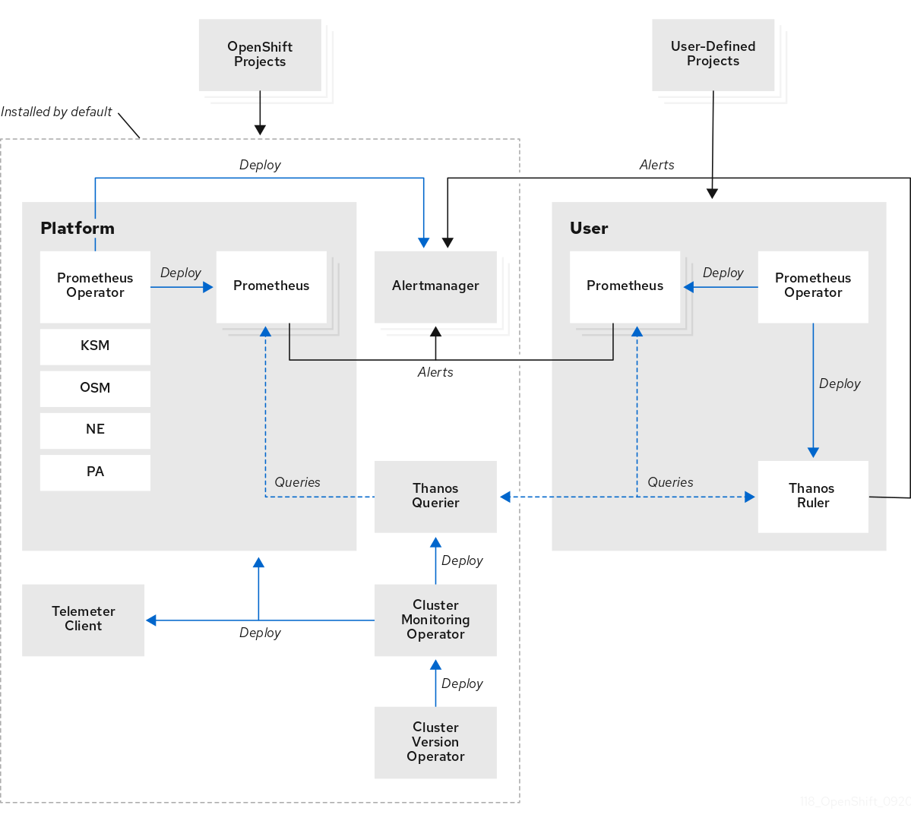

# Monitoring

[root@services ~]# oc get svc -n openshift-monitoring
NAME                                    TYPE        CLUSTER-IP       EXTERNAL-IP   PORT(S)                               AGE
alertmanager-main                       ClusterIP   172.30.7.64      <none>        9094/TCP,9092/TCP,9097/TCP            24h
alertmanager-operated                   ClusterIP   None             <none>        9093/TCP,9094/TCP,9094/UDP            24h
cluster-monitoring-operator             ClusterIP   None             <none>        8443/TCP                              33h
kube-state-metrics                      ClusterIP   None             <none>        8443/TCP,9443/TCP                     24h
monitoring-plugin                       ClusterIP   172.30.108.240   <none>        9443/TCP                              24h
node-exporter                           ClusterIP   None             <none>        9100/TCP                              24h
openshift-state-metrics                 ClusterIP   None             <none>        8443/TCP,9443/TCP                     24h
prometheus-adapter                      ClusterIP   172.30.234.11    <none>        443/TCP                               24h
prometheus-k8s                          ClusterIP   172.30.85.101    <none>        9091/TCP,9092/TCP                     24h
prometheus-k8s-thanos-sidecar           ClusterIP   None             <none>        10902/TCP                             24h
prometheus-operated                     ClusterIP   None             <none>        9090/TCP,10901/TCP                    24h
prometheus-operator                     ClusterIP   None             <none>        8443/TCP                              24h
prometheus-operator-admission-webhook   ClusterIP   172.30.237.112   <none>        8443/TCP                              24h
telemeter-client                        ClusterIP   None             <none>        8443/TCP                              24h
thanos-querier                          ClusterIP   172.30.45.221    <none>        9091/TCP,9092/TCP,9093/TCP,9094/TCP   24h
[root@services ~]#
