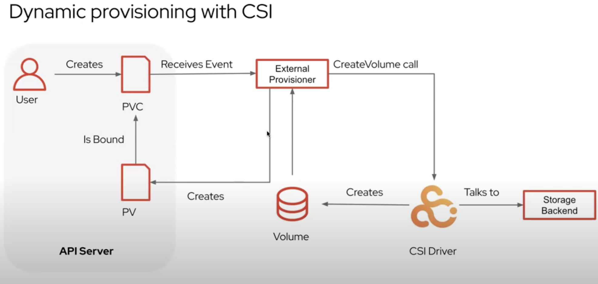
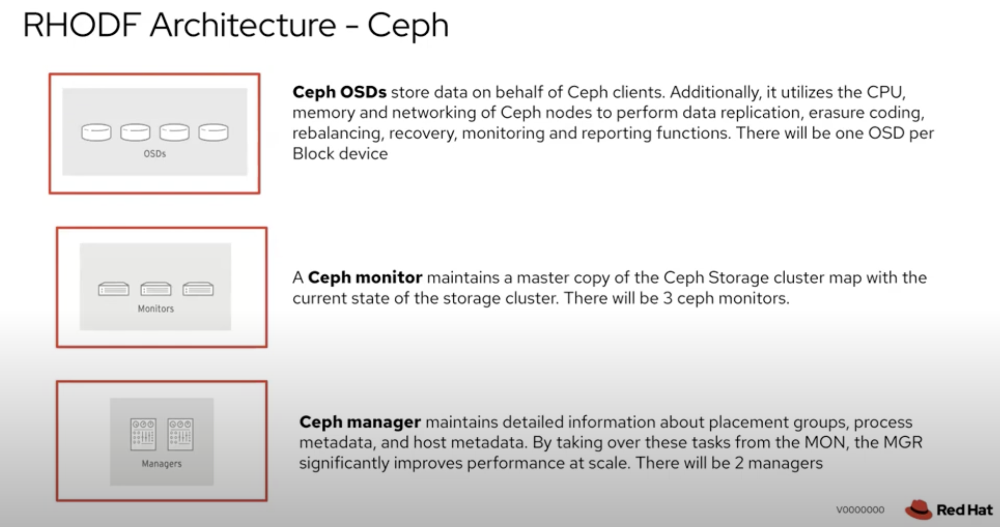
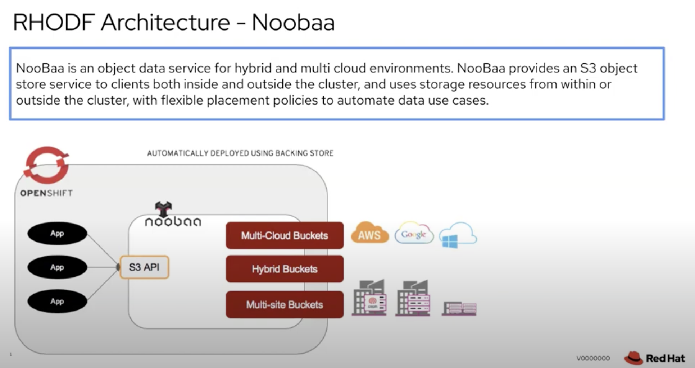
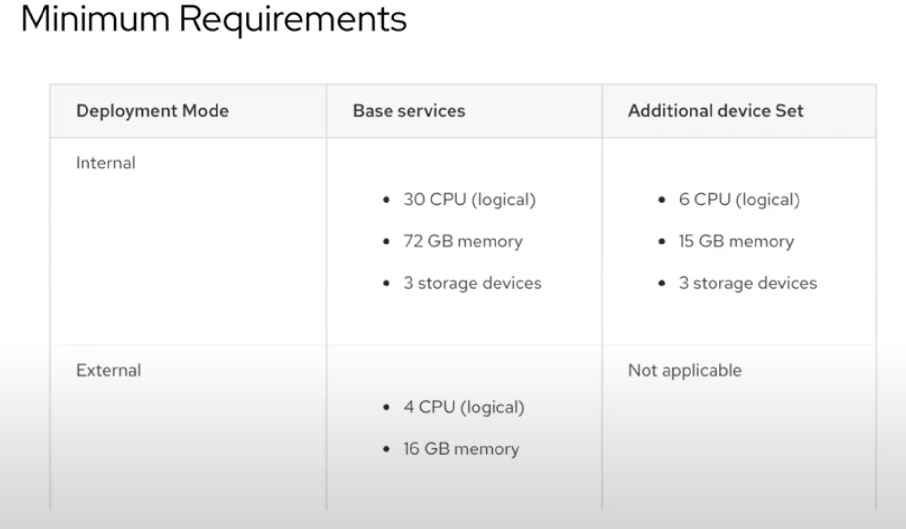

# Red Hat Openshift Data Foundation

Reference: https://www.youtube.com/watch?v=aq3FKXMAUu8

## RHODF Architecture

* ODF uses Ceph to provide file, block, and object storage
* ODF uses Rook to manage and orchestrate provisioning of persistent volumes and claims
* ODF uses NOOBA.io to provide object federation across multiple cloud environments

ODF features an interface called Container Storage Interface, CSI, which exposes file or block storage. 

### Internal vs External

You can use the **internal-attached** device approach in the graphical user interface (GUI) to deploy Red Hat OpenShift Data Foundation in internal mode using the local storage operator and local storage devices.

Ease of deployment and management are the highlights of running OpenShift Data Foundation services internally on OpenShift Container Platform. There are two different deployment modalities available when Red Hat OpenShift Data Foundation is running entirely within Red Hat OpenShift Container Platform:

* Simple
* Optimized

Red Hat OpenShift Data Foundation exposes the Red Hat Ceph Storage services running outside of the OpenShift Container Platform cluster as storage classes.

The external approach is best used when,

Storage requirements are significant (600+ storage devices).
Multiple OpenShift Container Platform clusters need to consume storage services from a common external cluster.
Another team, Site Reliability Engineering (SRE), storage, and so on, needs to manage the external cluster providing storage services. Possibly a pre-existing one.

### Ceph

### Nooba

## Requirements

Reference: https://docs.redhat.com/en/documentation/red_hat_openshift_data_foundation/4.15/html-single/planning_your_deployment/index?extIdCarryOver=true&sc_cid=7015Y0000045AAzQAM#resource-requirements_rhodf

## Installation

Reference: https://docs.redhat.com/en/documentation/red_hat_openshift_data_foundation/4.15/html-single/deploying_openshift_data_foundation_using_bare_metal_infrastructure/index#installing-local-storage-operator_local-bare-metal

https://www.youtube.com/watch?v=FwEgvsO21v4

For this installtion we will proceed with the installation of following cluster operators:

1. Local Cluster Operator
2. ODF Operator

### Provisioning local volumes by using the Local Storage Operator

*Prerequisites*

The Local Storage Operator is installed.

You have a local disk that meets the following conditions:

It is attached to a node.

It is not mounted.

It does not contain partitions.

