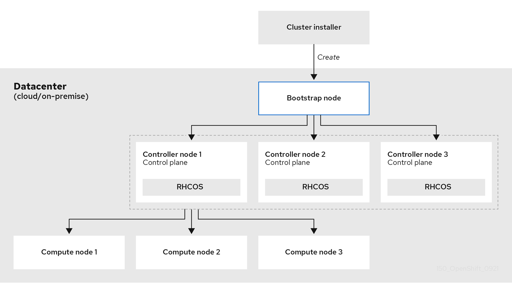
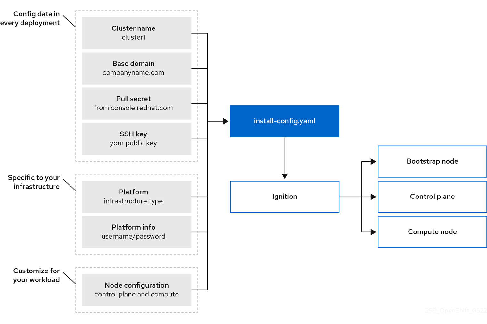
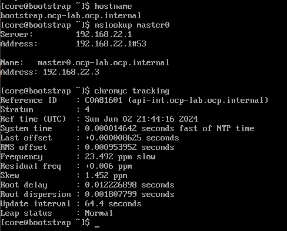
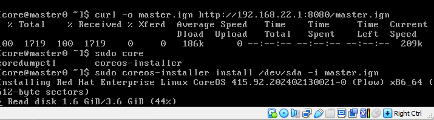
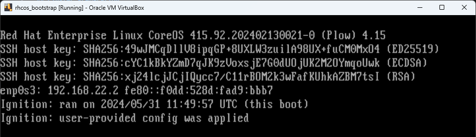
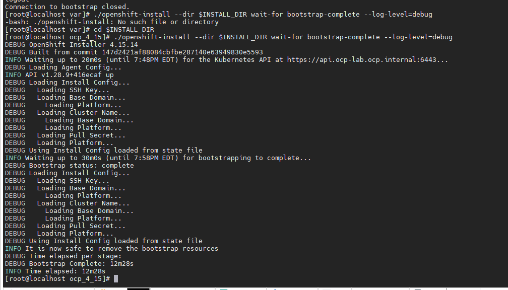
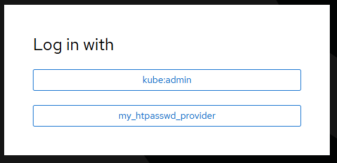

# Openshift Installation Lab

This documents demonstrates how to install a baremetal cluster for a lab environment using Virtual Box. 
It can be adapted to other environments like EXSI or even bare metal devices.

**Reference:** https://docs.openshift.com/container-platform/4.15/installing/installing_platform_agnostic/installing-platform-agnostic.html

## Resources

|Hostname|IP|vCPU|RAM|Storage|Services|OS|MAC Addr 1|MAC Addr 2|
|---|---|---|---|---|---|---|---|---|
|services.ocp.okd.local|	192.168.21.1|	4	|16	|150	|haproxy, dns, registry, nfs, dhcp|	centos8|	08:00:27:EF:FA:01|08:00:27:EF:FA:02
|bootstrap.okd-lab.okd.lab|	192.168.21.2|	4|	16|	100	|bootstrap| CoreOS|	08:00:27:05:13:82|
|master0.okd-lab.okd.lab|	192.168.21.3|	4|	16|	150|	master|	CoreOS|	08:00:27:05:13:83|
|master1.okd-lab.okd.lab|	192.168.21.4|	4|	16|	100|	master|	CoreOS|	08:00:27:05:13:84|
|master2.okd-lab.okd.lab|	192.168.21.5|	4|	16|	100|	master|	CoreOS|	08:00:27:05:13:85|
|worker0.okd-lab.okd.lab|	192.168.21.6|	2|	8	|100|	worker|	CoreOS|	08:00:27:05:13:86|
|worker1.okd-lab.okd.lab|	192.168.21.7|	2|	8	|100|	worker|	CoreOS|	08:00:27:05:13:87|

> **NOTE** \
Save at least 4GB of RAM for OS in case it runs in a single host machine.

### Cluster Topology

TODO: Add Genereval View Topology




## Cluster Preparation

### Service Node

Service Node purpose is provinding the following services:

1. DHCP for Cluster Network
2. DNS for Cluster Network
3. HTTP Server
4. Load Balancing
5. Registry
6. NTP Service for CoreOS nodes
7. Proxy Server

```shell
# Set hostname
$ hostnamectl set-hostname services.ocp.rdss.cloud
```

### DHCP Server

Install DHCP Server

```shell
sudo dnf -y install dhcp-server
```

Configure /etc/dhcp/dhcpd.conf

```shell
cat <<EOL > /etc/dhcp/dhcpd.conf
subnet 192.168.21.0 netmask 255.255.255.0 {
  range 192.168.21.2 192.168.21.254;
  option domain-name-servers 192.168.21.1; # Option 6
  option ntp-servers 192.168.21.1;  # Option 42
  option routers 192.168.21.1; # Replace with your actual gateway if different
}

host bootstrap.ocp.rdss.cloud {
  hardware ethernet 08:00:27:05:13:82;
  fixed-address 192.168.21.2; # Replace with the desired IP address for this MAC
}

host master1.ocp.rdss.cloud {
  hardware ethernet 08:00:27:05:13:83;
  fixed-address 192.168.21.3; # Replace with the desired IP address for this MAC
}

host master2.ocp.rdss.cloud {
  hardware ethernet 08:00:27:05:13:84;
  fixed-address 192.168.21.4; # Replace with the desired IP address for this MAC
}

host master3.ocp.rdss.cloud {
  hardware ethernet 08:00:27:05:13:85;
  fixed-address 192.168.21.5; # Replace with the desired IP address for this MAC
}

host worker0.ocp.rdss.cloud {
  hardware ethernet 08:00:27:05:13:86;
  fixed-address 192.168.21.6; # Replace with the desired IP address for this MAC
}

host worker1.ocp.rdss.cloud {
  hardware ethernet 08:00:27:05:13:87;
  fixed-address 192.168.21.7; # Replace with the desired IP address for this MAC
}
EOL
```

Start DHCP

```shell
sudo systemctl start dhcpd
sudo systemctl enable dhcpd
```

### DNS Server

Install DNS Server

```shell
sudo yum install bind bind-utils
```

Configure named.conf

```shell
# Options File

sed -i 's/listen-on port 53 { 127.0.0.1; };/listen-on port 53 { 127.0.0.1; 192.168.21.1; };/g' /etc/named.conf
sed -i 's/allow-query     { localhost; };/allow-query     { localhost; 192.168.21.0\/24; };/g' /etc/named.conf

echo "include \"/etc/named/named.conf.internal\";" >> /etc/named.conf
```

Add named.conf.internal

```shell
cat <<EOL > /etc/named/named.conf.internal
zone "ocp.rdss.cloud" {
    type master;
    file "/etc/named/zones/db.ocp.rdss.cloud"; # zone file path
};

zone "21.168.192.in-addr.arpa" {
    type master;
    file "/etc/named/zones/db.192.168.21";  # 192.168.21.0/24 subnet
};
EOL
```

Create Zones

```shell
sudo chmod 755 /etc/named
sudo mkdir /etc/named/zones

# Forward Zone
cat <<EOL > /etc/named/zones/db.ocp.rdss.cloud
\$TTL 1W
@ IN SOA services.ocp.rdss.cloud. root (
   2019070700 ; serial
   3H  ; refresh (3 hours)
   30M  ; retry (30 minutes)
   2W  ; expiry (2 weeks)
   1W )  ; minimum (1 week)
 IN NS services.ocp.rdss.cloud.
;
;
services.ocp.rdss.cloud.  IN A 192.168.21.1
;
helper.ocp.rdss.cloud.  IN A 192.168.21.1
helper.ocp.rdss.cloud. IN A 192.168.21.1
;
api.ocp.rdss.cloud.  IN A 192.168.21.1
api-int.ocp.rdss.cloud. IN A 192.168.21.1 
;
*.apps.ocp.rdss.cloud. IN A 192.168.21.1 
;
bootstrap.ocp.rdss.cloud. IN A 192.168.21.2 
;
master0.ocp.rdss.cloud. IN A 192.168.21.3 
master1.ocp.rdss.cloud. IN A 192.168.21.4 
master2.ocp.rdss.cloud. IN A 192.168.21.5 
;
worker0.ocp.rdss.cloud. IN A 192.168.21.6 
worker1.ocp.rdss.cloud. IN A 192.168.21.7 
;
EOL

# Reverse Zone
cat <<EOL > /etc/named/zones/db.192.168.21
\$TTL 1W
@ IN SOA services.ocp.rdss.cloud. root (
   2019070700 ; serial
   3H  ; refresh (3 hours)
   30M  ; retry (30 minutes)
   2W  ; expiry (2 weeks)
   1W )  ; minimum (1 week)
 IN NS services.ocp.rdss.cloud.
 ;
 
1.21.168.192.in-addr.arpa. IN PTR api.ocp.rdss.cloud. 
1.21.168.192.in-addr.arpa. IN PTR api-int.ocp.rdss.cloud. 
;
2.21.168.192.in-addr.arpa. IN PTR bootstrap.ocp.rdss.cloud. 
;
3.21.168.192.in-addr.arpa. IN PTR master0.ocp.rdss.cloud. 
4.21.168.192.in-addr.arpa. IN PTR master1.ocp.rdss.cloud. 
5.21.168.192.in-addr.arpa. IN PTR master2.ocp.rdss.cloud. 
;
6.21.168.192.in-addr.arpa. IN PTR worker0.ocp.rdss.cloud. 
7.21.168.192.in-addr.arpa. IN PTR worker1.ocp.rdss.cloud. 
;
EOL
```

Check if files are correct

```shell
# Check Zone Config
$ sudo named-checkconf

# Check forward zone
$ sudo named-checkzone ocp.rdss.cloud /etc/named/zones/db.ocp.rdss.cloud

# Check Reverse Zone
$ named-checkzone 88.168.192.in-addr.arpa /etc/named/zones/db.192.168.88
```

Start named and enable at boot time and allow dns rules

```shell
systemctl start named
systemctl enable named
firewall-cmd --permanent --add-port=53/udp
firewall-cmd --reload
```

Check DNS entries

```shell
# Forward DNS Validation
$ dig +noall +answer @192.168.21.1 api.ocp.rdss.cloud
$ dig +noall +answer @192.168.21.1 api-int.ocp.rdss.cloud
$ dig +noall +answer @192.168.21.1 random.apps.ocp.rdss.cloud
$ dig +noall +answer @192.168.21.1 console-openshift-console.apps.ocp.rdss.cloud
$ dig +noall +answer @192.168.21.1 bootstrap.apps.ocp.rdss.cloud

api.ocp.rdss.cloud.          604800  IN      A       192.168.21.1
api-int.ocp.rdss.cloud.      604800  IN      A       192.168.21.1
random.apps.ocp.rdss.cloud.  604800  IN      A       192.168.21.1
console-openshift-console.apps.ocp.rdss.cloud. 604800 IN A 192.168.21.1
bootstrap.apps.ocp.rdss.cloud. 604800 IN     A       192.168.21.1

# Reverse DNS Validation

$ dig +noall +answer @192.168.21.1 -x 192.168.21.1
$ dig +noall +answer @192.168.21.1 -x 192.168.21.2
$ dig +noall +answer @192.168.21.1 -x 192.168.21.3
$ dig +noall +answer @192.168.21.1 -x 192.168.21.4
$ dig +noall +answer @192.168.21.1 -x 192.168.21.5
$ dig +noall +answer @192.168.21.1 -x 192.168.21.6
$ dig +noall +answer @192.168.21.1 -x 192.168.21.7

2.21.168.192.in-addr.arpa. 604800 IN    PTR     bootstrap.ocp.rdss.cloud.
3.21.168.192.in-addr.arpa. 604800 IN    PTR     master0.ocp.rdss.cloud.
4.21.168.192.in-addr.arpa. 604800 IN    PTR     master1.ocp.rdss.cloud.
5.21.168.192.in-addr.arpa. 604800 IN    PTR     master2.ocp.rdss.cloud.
6.21.168.192.in-addr.arpa. 604800 IN    PTR     worker0.ocp.rdss.cloud.
7.21.168.192.in-addr.arpa. 604800 IN    PTR     worker1.ocp.rdss.cloud.
```

### HTTP Server

```shell
# Install Apache
$ sudo yum install httpd -y

# Change httpd port to 8080 because port 80 is used for openshift
$ sed -i 's/Listen 80/Listen 8080/' /etc/httpd/conf/httpd.conf

# Replace all 443 to 8443 at /etc/httpd/conf.d/ssl.conf
$ sed -i 's/443/8443/g' /etc/httpd/conf.d/ssl.conf

# Start and Enable Httpd
$ systemctl start httpd
$ systemctl enable httpd

$ chmod 755 /var/www/html
$ chown -R apache:apache /var/www/html

sudo firewall-cmd --permanent --add-port=8080/tcp
sudo firewall-cmd --reload
```

### NTP Server

Chrony runs by default on Centos8 ISO. Adjust the time sources if needed.

> **INFO**
> Do not set timezone for Openshift

```shell

# Add the necessary source at /etc/chrony.conf - For Nokia internal network use 10.171.8.4
# Please consider joining the pool (http://www.pool.ntp.org/join.html).
$ vi /etc/chrony.conf
pool 10.171.8.4 iburst

s
# Confgigure to listen specific networks. If left commented, will not work
sed -i 's/#allow 192.168.0.0\/16/allow 192.168.0.0\/16/' /etc/chrony.conf

# Confgigure firewall
firewall-cmd --permanent --add-port=123/udp
firewall-cmd --reload
```

### Internal Registry

Reference: <https://www.redhat.com/sysadmin/simple-container-registry>

```shell
# Install Podman
$ yum install -y podman httpd-tools

# Create Dirs
$ mkdir -p /opt/registry/{auth,certs,data}

# Store user/password
$ htpasswd -bBc /opt/registry/auth/htpasswd registryuser registryuserpassword

# Create SSL Certificates Self Signed
$ openssl req -newkey rsa:4096 -nodes -sha256 -keyout /opt/registry/certs/domain.key -x509 -days 365 -out /opt/registry/certs/domain.crt \
-addext "subjectAltName = DNS:services.ocp.rdss.cloud"

$ cp /opt/registry/certs/domain.crt /etc/pki/ca-trust/source/anchors/
$ update-ca-trust

$ trust list | grep -i "services.ocp.rdss.cloud"

# Start Registry

$ podman run --name myregistry \
-p 5000:5000 \
-v /opt/registry/data:/var/lib/registry:z \
-v /opt/registry/auth:/auth:z \
-e "REGISTRY_AUTH=htpasswd" \
-e "REGISTRY_AUTH_HTPASSWD_REALM=Registry Realm" \
-e REGISTRY_AUTH_HTPASSWD_PATH=/auth/htpasswd \
-v /opt/registry/certs:/certs:z \
-e "REGISTRY_HTTP_TLS_CERTIFICATE=/certs/domain.crt" \
-e "REGISTRY_HTTP_TLS_KEY=/certs/domain.key" \
-e REGISTRY_COMPATIBILITY_SCHEMA1_ENABLED=true \
-d \
docker.io/library/registry:latest

# Veriry Access

$ curl https://services.ocp.rdss.cloud:5000/v2/_catalog

# Login
$ podman login services.ocp.rdss.cloud:5000

# Stop registry:
$ podman stop myregistry

# Remove registry:
$ podman rm myregistry

# Delete registry image:
$ podman rmi registry:latest

# Remove certificate:
$ rm /etc/pki/ca-trust/source/anchors/domain.crt
$ update-ca-trust
$ trust list | grep "<hostname>"

# Enable fireall
$ firewall-cmd --permanent --add-port=5000/tcp
$ firewall-cmd --reload
```

### Load Balancing

```shell
# Install HAProxy LoadBalancer
$ sudo yum -y install haproxy

# SELinux policy for HAProxy
$ setsebool -P haproxy_connect_any=1

# Load Balancer Configuration
cat <<EOL > /etc/haproxy/haproxy.cfg
global
  log         127.0.0.1 local2
  pidfile     /var/run/haproxy.pid
  maxconn     4000
  daemon
defaults
  mode                    http
  log                     global
  option                  dontlognull
  option http-server-close
  option                  redispatch
  retries                 3
  timeout http-request    10s
  timeout queue           1m
  timeout connect         10s
  timeout client          1m
  timeout server          1m
  timeout http-keep-alive 10s
  timeout check           10s
  maxconn                 3000
frontend stats
    mode http
    bind *:9000
    stats enable
    stats uri /stats
    stats refresh 10s
    stats admin if LOCALHOST
listen api-server-6443 
  bind *:6443
  mode tcp
  option  httpchk GET /readyz HTTP/1.0
  option  log-health-checks
  balance roundrobin
  server bootstrap bootstrap.ocp.rdss.cloud:6443 verify none check check-ssl inter 10s fall 2 rise 3 backup 
  server master0 master0.ocp.rdss.cloud:6443 weight 1 verify none check check-ssl inter 10s fall 2 rise 3
  server master1 master1.ocp.rdss.cloud:6443 weight 1 verify none check check-ssl inter 10s fall 2 rise 3
  server master2 master2.ocp.rdss.cloud:6443 weight 1 verify none check check-ssl inter 10s fall 2 rise 3
listen machine-config-server-22623 
  bind *:22623
  mode tcp
  server bootstrap bootstrap.ocp.rdss.cloud:22623 check inter 1s backup 
  server master0 master0.ocp.rdss.cloud:22623 check inter 1s
  server master1 master1.ocp.rdss.cloud:22623 check inter 1s
  server master2 master2.ocp.rdss.cloud:22623 check inter 1s
listen ingress-router-443 
  bind *:443
  mode tcp
  balance source
  server worker0 worker0.ocp.rdss.cloud:443 check inter 1s
  server worker1 worker1.ocp.rdss.cloud:443 check inter 1s
listen ingress-router-80 
  bind *:80
  mode tcp
  balance source
  server worker0 worker0.ocp.rdss.cloud:80 check inter 1s
  server worker1 worker1.ocp.rdss.cloud:80 check inter 1s
EOL


# Start HAProxy
$ systemctl start haproxy.service
# Set HAproxy to start during boot
$ systemctl enable haproxy.service

# Check if HAProxy Listens to configured ports [6443, 22623, 443, 80]
$ netstat -nltupe

# Firewall Config
$ firewall-cmd --permanent --add-port=6443/tcp
$ firewall-cmd --permanent --add-port=22623/tcp
$ firewall-cmd --permanent --add-port=443/tcp
$ firewall-cmd --permanent --add-port=80/tcp
$ firewall-cmd --permanent --add-port=9000/tcp  # Stats page
$ firewall-cmd --reload
```

### Proxy Server

Configure the proxy server to mimic environments not directly connected to Internet

```shell
# Install squid
$ sudo yum install squid -y

# Configure Squid
$ vi /etc/squid/squid.conf

# Change port if needed
http_port 3128

# Modify the access list to allow traffic from specific nets
acl internalnet src 192.168.21.0/24
http_access allow internalnet
http_access deny all

# If the service node does not access Internet directly and required a proxy,
# then configure a upstream proxy

cache_peer <upstream_proxy_address> parent <upstream_proxy_port> 0 no-query default
never_direct allow all

##### Multiprocessing
# Workers configuration
workers 4

# Cache settings
cache_mem 256 MB
maximum_object_size_in_memory 512 KB
cache_dir ufs /var/spool/squid 10000 16 256
maximum_object_size 4 MB

# File descriptors
max_filedesc 4096

# CPU affinity
cpu_affinity_map process_numbers=1,2,3,4 cores=1,2,3,4

#######################################

# Start and Enable the Service
sudo systemctl start squid
sudo systemctl enable squid

# Firewall Configuration
$ firewall-cmd --permanent --add-port=3128/tcp
$ firewall-cmd --reload

```

### NFS Server

```shell
$ yum install nfs-utils
$ systemctl start nfs-server
$ systemctl enable nfs-server

# The configuration files for the NFS server are:

# /etc/nfs.conf – main configuration file for the NFS daemons and tools.
# /etc/nfsmount.conf – an NFS mount configuration file.

$ mkdir -p  /mnt/nfs_shares/registry
$ chown -R nobody: /mnt/nfs_shares/registry
$ systemctl restart nfs-utils.service

# Configure /etc/exports file
$ cat <<EOL > /etc/exports
/mnt/nfs_shares/registry  192.168.21.0/24(rw,sync,no_all_squash,root_squash)
EOL

# Export the filesystem
$ exportfs -arv

# Check which files are being shared
$ exportfs -s

# Configure Firewall
$ firewall-cmd --permanent --add-service=nfs
$ firewall-cmd --permanent --add-service=rpc-bind
$ firewall-cmd --permanent --add-service=mountd
$ firewall-cmd --reload
```

### SSH Keys

Create a private/public key pair for the installation

```shell
ssh-keygen -t rsa -b 4096 -f ~/.ssh/id_rsa
```

Add the SSH private key identity to the SSH agent for your internal user, if it has not already been added. SSH agent management of the key is required for password-less SSH authentication onto your cluster nodes, or if you want to use the ./openshift-install gather command.

```shell
eval "$(ssh-agent -s)"
ssh-add ~/.ssh/id_rsa
```

### Obtaining the installation program

Before you install ocp, download the installation file on the host you are using for installation.

Prerequisites
You have a computer that runs Linux or macOS, with 500 MB of internal disk space.

Procedure
Download installer from [<https://github.com/openshift/ocp/releases>](https://access.redhat.com/downloads/content/290/)

Example:

```shell
mkdir /root/ocp_4_15
INSTALL_DIR=/root/ocp_4_15
cd $INSTALL_DIR

# Extract the image file

$ tar -xvf openshift-install-linux-4.15.0-0.ocp-2024-03-10-010116.tar.gz
```

#### Download Red Hat Pull Secret from Cluser Management

TODO: Add how to download secret

### Install Openshift CLI

```shell
curl -o $INSTALL_DIR/oc.tar.gz https://mirror.openshift.com/pub/openshift-v4/clients/oc/latest/linux/oc.tar.gz

# Untar the file
tar -xvf $INSTALL_DIR/oc.tar.gz

mv $INSTALL_DIR/oc /usr/local/bin
mv $INSTALL_DIR/kubectl /usr/local/bin
```

### Creating the installation configuration file

This section creates the resource files used in the installation.

The following components will be populated in the install-config.yaml:

1. Cluster Name
2. Base Domain
3. Pull Secret
4. SSH Key

Those resources will be converted into the ignitions files which will be:

1. Bootstrap
2. Controle Plane or Master
3. Compute Node or Worker



```shell

# Carefully review the information provided for this file, specially if using proxy.
cat <<EOL > $INSTALL_DIR/install-config.yaml
additionalTrustBundlePolicy: Proxyonly
apiVersion: v1
baseDomain: rdss.cloud
compute:
- architecture: amd64
  hyperthreading: Enabled
  name: worker
  platform: {}
  replicas: 0
controlPlane:
  architecture: amd64
  hyperthreading: Enabled
  name: master
  platform: {}
  replicas: 3
metadata:
  creationTimestamp: null
  name: ocp
networking:
  clusterNetwork:
  - cidr: 10.128.0.0/14
    hostPrefix: 23
  machineNetwork:
  - cidr: 10.0.0.0/16
  networkType: OVNKubernetes
  serviceNetwork:
  - 172.30.0.0/16
platform:
  none: {}
proxy:
  httpProxy: http://services.ocp.:3128
  httpsProxy: http://services.ocp.rdss.cloud:3128
  noProxy: rdss.cloud,192.168.21.0/24
publish: External
pullSecret: '{"auths":{"cloud.openshift.com":{"auth":"b3BlbnNoaWZ0LXJlbGVhc2UtZGV2K29jbV9hY2Nlc3NfY2JjZmNlNjE3YWJmNGNiMDg1MDE0YTQ3ZTdiZGFlY2E6VFI2QjFYMEkxMEo2MjVDQ0ZYNjdSWlE0NE9PV1c2RUVTM1ZYOE8wUTVaQUoxQVAwNEJMTFVJMFhUUkszQzhGRw==","email":"roger.sacchelli@gmail.com"},"quay.io":{"auth":"b3BlbnNoaWZ0LXJlbGVhc2UtZGV2K29jbV9hY2Nlc3NfY2JjZmNlNjE3YWJmNGNiMDg1MDE0YTQ3ZTdiZGFlY2E6VFI2QjFYMEkxMEo2MjVDQ0ZYNjdSWlE0NE9PV1c2RUVTM1ZYOE8wUTVaQUoxQVAwNEJMTFVJMFhUUkszQzhGRw==","email":"roger.sacchelli@gmail.com"},"registry.connect.redhat.com":{"auth":"fHVoYy1wb29sLTA0Nzc3ZTA2LTZkYzgtNDhmZi1iZWQxLWY1OTA4NTRiYmRjMDpleUpoYkdjaU9pSlNVelV4TWlKOS5leUp6ZFdJaU9pSTVPV0kyWkRFd1lUWTBORGswTkRGallqY3hOall4TTJNME9EZzRabUl5WVNKOS5IOEtPRmVzWWpsUDJBSXRMZ2hfa2U4TjFvZGJuQkNPTkM3a29FSW5oTEUyVlZUZ192VHRmUENydThzX09NaVRHVmpTVHFaNDlCVWZZNnYzakxsRDlOTTRHNXdEU25taWE2MWdQOHEwbEsycDA2dUVNRU1rck5sVjB4VGpScWY0M1ZscUY0WWNPU3lWdGllYmhCZFdmQ1VYZjZrb0pnQk8xeFJuTmFnMmd4aTRxWGRvczdXX0Uxa0pLajM2OXd0V1o4SFppTnN1ZUxQaGRGQlF4cFNvenBtWWpRbzYweEt1TGk5cnAxVnJraUZuNHNzdnBDU2JpSTlwWGZXTmlKd0x0WDNmSkdGckowNFJEaDVCMGYteVBhcnNoR1BobTBWWHRQSFE2VjlsWE53cEI1Wm5Wc3prWjNWYk9HZ1VnNFVOYXJrSlJwc080WU43US1ibkh2OXU0UjhEbFh6YjF0cC1hQXhIbjdqVXVLeW0yclJST0RQaFhmaUE2djRFN1gxQUIyQzZJTGtGaTRfdGZnNUc5QUpNU1JtYXVfalNkM2Y5MktGTXlJYmZxanJWMy1PT1lBSnI0Slkzd0N1MDVDQ2lKdFV1YkgxczFqdklYZ1NYcWtvaUtUS0pKcnQ2VDdHZmtpSzRyWExNMEQtYk9tckE5cVVEeWVVMnVyUkpnUmhsTWtuMlhNVFJELUlkM0FXQ3pwd1gzdzZ6cnBlNjRHWUxyTDNyOElsam5GcUlvakZBUC1VaEpJQUY3QWZiOHhYbkV1ZU1hZ3A4MTJWa3NzZlJkT0lKVW5SSFcwRnNLMFNtaWRicFN1c2Y0TmxuUFVRNW5FaU1KeVhGLVZXRlFBV0wyRlRRMlFRV1ZKQktGWExveUQ5RFREallmVUY1aHNTRXpLQTR3YzJTb05yMA==","email":"roger.sacchelli@gmail.com"},"registry.redhat.io":{"auth":"fHVoYy1wb29sLTA0Nzc3ZTA2LTZkYzgtNDhmZi1iZWQxLWY1OTA4NTRiYmRjMDpleUpoYkdjaU9pSlNVelV4TWlKOS5leUp6ZFdJaU9pSTVPV0kyWkRFd1lUWTBORGswTkRGallqY3hOall4TTJNME9EZzRabUl5WVNKOS5IOEtPRmVzWWpsUDJBSXRMZ2hfa2U4TjFvZGJuQkNPTkM3a29FSW5oTEUyVlZUZ192VHRmUENydThzX09NaVRHVmpTVHFaNDlCVWZZNnYzakxsRDlOTTRHNXdEU25taWE2MWdQOHEwbEsycDA2dUVNRU1rck5sVjB4VGpScWY0M1ZscUY0WWNPU3lWdGllYmhCZFdmQ1VYZjZrb0pnQk8xeFJuTmFnMmd4aTRxWGRvczdXX0Uxa0pLajM2OXd0V1o4SFppTnN1ZUxQaGRGQlF4cFNvenBtWWpRbzYweEt1TGk5cnAxVnJraUZuNHNzdnBDU2JpSTlwWGZXTmlKd0x0WDNmSkdGckowNFJEaDVCMGYteVBhcnNoR1BobTBWWHRQSFE2VjlsWE53cEI1Wm5Wc3prWjNWYk9HZ1VnNFVOYXJrSlJwc080WU43US1ibkh2OXU0UjhEbFh6YjF0cC1hQXhIbjdqVXVLeW0yclJST0RQaFhmaUE2djRFN1gxQUIyQzZJTGtGaTRfdGZnNUc5QUpNU1JtYXVfalNkM2Y5MktGTXlJYmZxanJWMy1PT1lBSnI0Slkzd0N1MDVDQ2lKdFV1YkgxczFqdklYZ1NYcWtvaUtUS0pKcnQ2VDdHZmtpSzRyWExNMEQtYk9tckE5cVVEeWVVMnVyUkpnUmhsTWtuMlhNVFJELUlkM0FXQ3pwd1gzdzZ6cnBlNjRHWUxyTDNyOElsam5GcUlvakZBUC1VaEpJQUY3QWZiOHhYbkV1ZU1hZ3A4MTJWa3NzZlJkT0lKVW5SSFcwRnNLMFNtaWRicFN1c2Y0TmxuUFVRNW5FaU1KeVhGLVZXRlFBV0wyRlRRMlFRV1ZKQktGWExveUQ5RFREallmVUY1aHNTRXpLQTR3YzJTb05yMA==","email":"roger.sacchelli@gmail.com"}}}'
sshKey: ssh-rsa AAAAB3NzaC1yc2EAAAADAQABAAACAQDdF/4LdxPoMm7S6Q2L9jVUY63UoEVvt+dA9RCNPVOVHQB78jfABxUPzPqt3+EQw6nbZKLiX0f4mloJG3AH6xDgYDnquGStxs6TVspdh7On+kjNgOkfpZqhBxC66YBDE3BtzZvBZ9k+HpOV2xR+n0cxqSe3yC15ynP+Y+7HmXwuntT/HWr24YiKuHb9SLoiDH83X3NIgSeQQEtRcfSyk7Ulop+9yAme/D4C7myjEPlc3LMYoJojVwIk629MJdcGjmkBQcP7h0gyTnrqUEKUMhYGiCFodxoZOq6fZqgAZ26X4m0YL3X7OF1oNQEmgk6ryWSpmXUA+mA9qXH3aPCDKEQKrIqnadGI9q2P9QY0E+IIz7QXq8wEW7YLQC2ASUTI6rBnbLIgr1si3lpVxhG8vQ33Nt94usCII9EsyH0idsU0qIYGf4W//SNaMqHHwHiLHG7G5eRlMHZzByiyXUcYDQxTORdRSvE8LpxIbudWWlFANJIea9aiU4U6yFQ6Mpd5jrtAMn68ZmgRtckKc5Z1RhnL6Z572duS6grRFaxEW4sDa6fvXadRhmW8TC1O9W7ur3qcALYd2UMENajCqpQcLZCcYTLzMvD1PQc7ardog7iSKbXA7sRI+2ohLVP0ew4mczS0e2KguooONBg81uAWH030atpMxRBhDjvg4O7isIrjqw== root@services.ocp.rdss.cloud
EOL
```

### Create Installation Files

```shell
# Create a backup of this because this file will disapear after manifests creation 
$ cp $INSTALL_DIR/install-config.yaml $INSTALL_DIR/install-config.yaml.bkp

# Manifest Files
$ $INSTALL_DIR/openshift-install create manifests --dir $INSTALL_DIR

#INFO Consuming Install Config from target directory
#WARNING Making control-plane schedulable by setting MastersSchedulable to true for Scheduler cluster settings
#INFO Manifests created in: manifests and openshift

# If you are creating a three node cluster, skip following step:
$ sed -i 's/true/false/' $INSTALL_DIR/manifests/cluster-scheduler-02-config.yml

#### Create Ignition Files
$ $INSTALL_DIR/openshift-install create ignition-configs --dir $INSTALL_DIR

#INFO Consuming OpenShift Install (Manifests) from target directory
#INFO Consuming Master Machines from target directory
#INFO Consuming Openshift Manifests from target directory
#INFO Consuming Worker Machines from target directory
#INFO Consuming Common Manifests from target directory
#INFO Ignition-Configs created in: . and auth

# Copy the ignition files to apache directory
cp $INSTALL_DIR/*.ign /var/www/html/
chmod 644 /var/www/html/*
```

### Installing CoreOS

This installation will be executed using the ISO image. Create the Virtual Machine for all the nodes listed at the beggining of the document. Pay attention to the MAC address to the network interface, which will be important by the DHCP server to provide correct information to each host.

**1. Download the ISO image**

Get the CoreOS ISO image for x86_64 with by accessing the given:

```shell
# Image URL
$INSTALL_DIR/openshift-install coreos print-stream-json | grep '\x86_64.iso[^.]'

```

Boot the ISO image which will take you to the prompt where we will run the installation commands.

> **ALERT**\
Start with the bootstrap node, then Master nodes and then worker nodes.


Once logged into VM, check if DNS, DHCP and NTP are working properly:

```shell
# Check hostname if matches dhcp configuration
$ hostname

# Check dns resolution for other node
$ nslookup master0

# Check NTP Server
$ chronyc tracking
```



If you have a similar output, move ahead.

**2. Download the ign file and start the installation**

```shell
# Download the ignition file from http server, according to each node installation (Bootstrap/Master/Worker)
$ curl -o bootstrap.ign services:8080/bootstrap.ign

# Check if the content of file is valid
$ cat bootstrap.ign

# Install coreos bootstrap
$ sudo coreos-installer install /dev/sda -i bootstrap.ign

# Shutdown the image
$ sudo shutdown now
```

Example for **master** installation:



**3. After shutdown, remove the media and boot the system again**

CoreOS will load the ignition file.



> **INFO** \
Do the same for all nodes, pay attention to ignition files correct name.


**4. Check the installation progress**

```shell
# Install Log file
$ tail -f $INSTALL_DIR/.openshift_install.log

# Bootstrap Node Journal
ssh core@bootstrap journalctl -b -f -u bootkube.service

# Log for bootstrap install
$INSTALL_DIR/openshift-install --dir $INSTALL_DIR wait-for bootstrap-complete --log-level=debug

```


### CSR Approval

Once Master nodes are finished, worker nodes will require approval for joining the cluster. Approve all pending CSRs:

```shell
$ oc get csr
#NAME        AGE     SIGNERNAME                                    REQUESTOR                                                                   REQUESTEDDURATION   CONDITION
#csr-5vcfs   9m9s    kubernetes.io/kube-apiserver-client-kubelet   system:serviceaccount:openshift-machine-config-operator:node-bootstrapper   <none>              Pending
#csr-mrw5q   8m59s   kubernetes.io/kube-apiserver-client-kubelet   system:serviceaccount:openshift-machine-config-operator:node-bootstrapper   <none>              Pending
#csr-p9p45   9m40s   kubernetes.io/kube-apiserver-client-kubelet   system:serviceaccount:openshift-machine-config-operator:node-bootstrapper   <none>              Pending
#csr-s2gqb   9m51s   kubernetes.io/kube-apiserver-client-kubelet   system:serviceaccount:openshift-machine-config-operator:node-bootstrapper   <none>              Pending

$ oc adm certificate approve <csr>
```

### Check Cluster Operator

```shell
# Check if all Cluster Operators are Running - If all available, then it means cluster is healthy
$ oc get co
NAME                                       VERSION   AVAILABLE   PROGRESSING   DEGRADED   SINCE   MESSAGE
authentication                             4.15.14   True        False         False      29m
baremetal                                  4.15.14   True        False         False      4h48m
cloud-controller-manager                   4.15.14   True        False         False      4h54m
cloud-credential                           4.15.14   True        False         False      5h
cluster-autoscaler                         4.15.14   True        False         False      4h48m
config-operator                            4.15.14   True        False         False      4h49m
console                                    4.15.14   True        False         False      33m
control-plane-machine-set                  4.15.14   True        False         False      4h48m
csi-snapshot-controller                    4.15.14   True        False         False      4h49m
dns                                        4.15.14   True        False         False      4h35m
etcd                                       4.15.14   True        False         False      4h47m
image-registry                             4.15.14   True        False         False      4h39m
ingress                                    4.15.14   True        False         False      37m
insights                                   4.15.14   True        False         False      4h42m
kube-apiserver                             4.15.14   True        False         False      4h35m
kube-controller-manager                    4.15.14   True        False         False      4h45m
kube-scheduler                             4.15.14   True        False         False      4h44m
kube-storage-version-migrator              4.15.14   True        False         False      4h49m
machine-api                                4.15.14   True        False         False      4h48m
machine-approver                           4.15.14   True        False         False      4h48m
machine-config                             4.15.14   True        False         False      4h47m
marketplace                                4.15.14   True        False         False      4h47m
monitoring                                 4.15.14   True        False         False      34m
network                                    4.15.14   True        False         False      4h49m
node-tuning                                4.15.14   True        False         False      127m
openshift-apiserver                        4.15.14   True        False         False      18m
openshift-controller-manager               4.15.14   True        False         False      4h44m
openshift-samples                          4.15.14   True        False         False      4h40m
operator-lifecycle-manager                 4.15.14   True        False         False      4h47m
operator-lifecycle-manager-catalog         4.15.14   True        False         False      4h48m
operator-lifecycle-manager-packageserver   4.15.14   True        False         False      4h42m
service-ca                                 4.15.14   True        False         False      4h49m
storage                                    4.15.14   True        False         False      4h49m
```


### Image registry storage configuration

The Image Registry Operator is not initially available for platforms that do not provide default storage. After installation, you must configure your registry to use storage so that the Registry Operator is made available.

Instructions are shown for configuring a persistent volume, which is required for production clusters. Where applicable, instructions are shown for configuring an empty directory as the storage location, which is available for only non-production clusters.

**Prerequisites**
* You have access to the cluster as a user with the cluster-admin role.

* You have a cluster that uses manually-provisioned Red Hat Enterprise Linux CoreOS (RHCOS) nodes, such as bare metal.

* You have provisioned persistent storage for your cluster. In our case we did that at the beggining of procedure.

OpenShift Container Platform supports ReadWriteOnce access for image registry storage when you have only one replica. ReadWriteOnce access also requires that the registry uses the Recreate rollout strategy. To deploy an image registry that supports high availability with two or more replicas, ReadWriteMany access is required.

Must have 100Gi capacity.

```shell
# Verify that you do not have a registry pod. If you have something in this output, skip the procedure
$ oc get pod -n openshift-image-registry -l docker-registry=default

# Edit the Image Registry Operator
$ oc edit configs.imageregistry.operator.openshift.io

# Add the following:
storage:
  pvc:
    claim:

# Check cluster Operator, a new PVC will be created in pending state since no PV is yet available
$ oc get pvc -n openshift-image-registry

# Configure Registry to manage images:
$ oc edit configs.imageregistry/cluster

# Change from
managementState: Removed 
to 
managementState: Managed

# Create the PV configuration:

$ vi $INSTALL_DIR/pv-registry.yaml
apiVersion: v1
kind: PersistentVolume
metadata:
  name: registry-pv
spec:
  accessModes:
    - ReadWriteMany
  capacity:
    storage: 100Gi
  persistentVolumeReclaimPolicy: Retain
  nfs:
    path: /mnt/nfs_shares/registry
    server: 192.168.21.1

$ oc create -f $INSTALL_DIR/pv-registry.yaml

# Check the status of PVC, it needs to be bound to new PV
$ oc get pvc -n openshift-image-registry
NAME                     STATUS   VOLUME        CAPACITY   ACCESS MODES   STORAGECLASS   AGE
image-registry-storage   Bound    registry-pv   100Gi      RWX                           20m

```

### Web Access

After completing installtion, run the following command to get instructions to log into web console:

```shell
$ $INSTALL_DIR/openshift-install --dir $INSTALL_DIR wait-for install-complete

INFO Access the OpenShift web-console here: https://console-openshift-console.apps.ocp.rdss.cloud
INFO Login to the console with user: "kubeadmin", and password: "QQvyx-mmDC5-IMGyF-LcaU8"
INFO Time elapsed: 0s
```

### Credentials

#### HTPASSWD (Local Authentication)

Create creadentials for the cluster to be used with Oauth Server and htpasswd.

Using htpasswd authentication in OpenShift Container Platform allows you to identify users based on an htpasswd file. An htpasswd file is a flat file that contains the user name and hashed password for each user. You can use the htpasswd utility to create this file.

> **NOTE** \
> In this method, credential will be stored as a secret in OCP not in OS.

**References:** 
* https://docs.openshift.com/container-platform/4.15/authentication/identity_providers/configuring-htpasswd-identity-provider.html#identity-provider-overview_configuring-htpasswd-identity-provider

* https://docs.openshift.com/container-platform/4.15/authentication/using-rbac.html#adding-roles_using-rbac

```shell
# Create username and password using htpasswd, in this case username/password
$ htpasswd -c -B -b $INSTALL_DIR/users.htpasswd username password

$ oc create secret generic htpass-secret --from-file=htpasswd=$INSTALL_DIR/users.htpasswd -n openshift-config 

# Edit the cluster resource to enable htpasswd:
$ oc edit oauth cluster
spec:
  identityProviders:
  - name: my_htpasswd_provider 
    mappingMethod: claim 
    type: HTPasswd
    htpasswd:
      fileData:
        name: htpass-secret 
```

Example of console login after


It is also require to bind a role for the user or to assign a cluster admin:

```shell
# Add Cluster Admin
$ oc adm policy add-cluster-role-to-user cluster-admin <user>

# Add role to user
$ oc adm policy add-role-to-user <role> <user> -n <project>
```


## Cluster Removal

```shell
$INSTALL_DIR/openshift-install destroy cluster --dir $INSTALL_DIR
```

## Troubleshooting Installation

* https://github.com/openshift/installer/blob/master/docs/user/troubleshooting.md
* https://github.com/openshift/installer/blob/master/docs/user/troubleshootingbootstrap.md


## OCP Alerts

https://github.com/openshift/runbooks/tree/master/alerts


## Registry

Login

Log in to the container image registry by using your access token
oc debug nodes/worker0.ocp-cluster.rdss.cloud
chroot /host


oc login -u kubeadmin -p aRryg-s6DtB-INkuF-RAMAH https://api-int.ocp-cluster.rdss.cloud:6443
podman login -u kubeadmin -p $(oc whoami -t) image-registry.openshift-image-registry.svc:5000