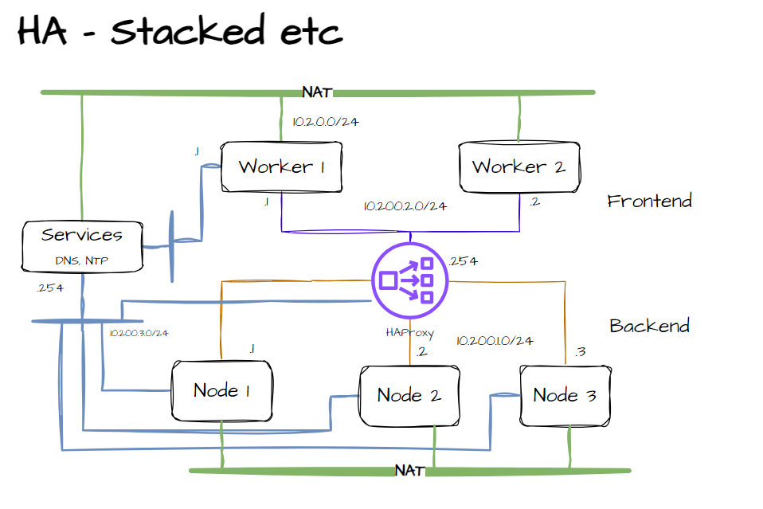

# High Availability Cluster Lab

In this lab we demonstrate how to setup a High Availability (HA) Cluster using kubeadm and an external HAProxy server to distribute
the load between the master nodes. We will also configure a stateless application.

# Design

## High Availability

In this example is used the "Stacked etcd Cluster" where etcd is stacked to master node.

## Topology



## HAProxy Load Balancing

HAProxy is configured so that Load Balancing is achieved between control nodes 1 to 3.

```shell
frontend apiserver-master
    bind 10.200.1.254:6443
    mode tcp
    option tcplog
    default_backend apiserverbackend

frontend apiserver-worker
    bind 10.200.2.254:6443
    mode tcp
    option tcplog
    default_backend apiserverbackend
```

In order to worker node traffic which is ranged on worker network 10.200.2.0/24 to reach APISERVER, it is required that HAProxy node routes traffic from one network another, which is achieved by setting systctl ipv4 forwarding to 1.

```shell
sudo sysctl -w net.ipv4.ip_forward=1
echo 'sysctl -w net.ipv4.ip_forward=1' | sudo tee -a /etc/sysctl.conf
```

## Requirements

* OS: Ubuntu 22.04
* Control Nodes: 2 vCPU / 2 GB RAM
* Master Nodes: 1 vCPU / 1 GB RAM
* HAProxy: 1vCPU / 1 GB RAM

# Configurationss

## Cluster Deployment

Vagrant is used to deploy the virtual machines with minimum efforts. Check the Vagrantfile for details.

Usefull commands, at the directory containing the Vagrantfile:

```shell
# Start VMs
vagrant up

# Status
vagrant status

# Log into VM
vagrant ssh <vm_name>

# Destroy Cluster
vagrant destroy <vm_name>
```
> [!NOTE]
> Vagrantfile together to bootstrap.sh creates the required environment to jump directly to kubernetes cluster initiations.

## Node Deployment

In order to configure the first master node, execute the following command:

```shell
sudo kubeadm init --control-plane-endpoint "<CLUSTER_HA_IP>:6443" --pod-network-cidr=10.244.0.0/16 --upload-certs --apiserver-advertise-address=<NODE_IP_ADDRESS>
```

In this example Cluster HA IP will be 10.200.1.254, which is the GW IP of the network facing master nodes. HAProxy is configure to distribute the traffic among the master nodes.

The first master node configured will output the commands required to add the remaining nodes.

```shell
#Your Kubernetes control-plane has initialized successfully!

#To start using your cluster, you need to run the following as a regular user:

  mkdir -p $HOME/.kube
  sudo cp -i /etc/kubernetes/admin.conf $HOME/.kube/config
  sudo chown $(id -u):$(id -g) $HOME/.kube/config

#Alternatively, if you are the root user, you can run:

  export KUBECONFIG=/etc/kubernetes/admin.conf

#You should now deploy a pod network to the cluster.
Run "kubectl apply -f [podnetwork].yaml" with one of the options listed at:
  https://kubernetes.io/docs/concepts/cluster-administration/addons/

#You can now join any number of the control-plane node running the following command on each as root:

  kubeadm join 10.200.1.254:6443 --token hvlc8v.opw36dwb0wesnort \
        --discovery-token-ca-cert-hash sha256:8c0c7d69826e89d8bc72c11ee1b6e4c9d49ade1c68bf4696b4b9f9813f8d74a5 \
        --control-plane --certificate-key 17d0e751e834eaa30625974bacc9fed2b6404348d9fe6f3b68ac9e59868de0c3

# Please note that the certificate-key gives access to cluster sensitive data, keep it secret!
# As a safeguard, uploaded-certs will be deleted in two hours; If necessary, you can use

"kubeadm init phase upload-certs --upload-certs" 

# to reload certs afterward.

#Then you can join any number of worker nodes by running the following on each as root:

kubeadm join 10.200.1.254:6443 --token hvlc8v.opw36dwb0wesnort \
        --discovery-token-ca-cert-hash sha256:8c0c7d69826e89d8bc72c11ee1b6e4c9d49ade1c68bf4696b4b9f9813f8d74a5
```

>[!WARNING]
> Remember to include --apiserver-advertise-address=<NODE_IP> in the kubeadm join command for master and worker nodes so that api-server is bound to correct IPs

<b>Container Network Interface</b>

It's required to use a Container Network Interface, in this case use Calico. If CNI is not installed, node will not start.

```shell
kubectl apply -f https://raw.githubusercontent.com/projectcalico/calico/v3.27.0/manifests/calico.yaml
```

```shell
vagrant@master-node1:~$ kubectl get nodes
NAME           STATUS     ROLES           AGE    VERSION
master-node1   NotReady   control-plane   7m1s   v1.26.11

vagrant@master-node1:~$ kubectl get nodes
NAME           STATUS   ROLES           AGE     VERSION
master-node1   Ready    control-plane   8m28s   v1.26.11

```

Add the remaining master nodes

```shell
kubeadm join 10.200.1.254:6443 --token hvlc8v.opw36dwb0wesnort \
        --discovery-token-ca-cert-hash sha256:8c0c7d69826e89d8bc72c11ee1b6e4c9d49ade1c68bf4696b4b9f9813f8d74a5 \
        --control-plane --certificate-key 17d0e751e834eaa30625974bacc9fed2b6404348d9fe6f3b68ac9e59868de0c3 --apiserver-advertise-address=<NODE_IP>

 ```

Add the worker nodes:

```shell
kubeadm join 10.200.1.254:6443 --token hvlc8v.opw36dwb0wesnort \
        --discovery-token-ca-cert-hash sha256:8c0c7d69826e89d8bc72c11ee1b6e4c9d49ade1c68bf4696b4b9f9813f8d74a5 --apiserver-advertise-address=<NODE_IP>
```

### Cluster Status

```shell
vagrant@master-node2:~$ kubectl get nodes
NAME           STATUS   ROLES           AGE     VERSION
master-node1   Ready    control-plane   77m     v1.26.12
master-node2   Ready    control-plane   67m     v1.26.12
master-node3   Ready    control-plane   65m     v1.26.12
worker-node1   Ready    <none>          7m14s   v1.26.12
worker-node2   Ready    <none>          3m30s   v1.26.12
worker-node3   Ready    <none>          2m58s   v1.26.12

vagrant@master-node2:~$ kubectl cluster-info
Kubernetes control plane is running at https://10.200.1.254:6443
CoreDNS is running at https://10.200.1.254:6443/api/v1/namespaces/kube-system/services/kube-dns:dns/proxy

To further debug and diagnose cluster problems, use 'kubectl cluster-info dump'.
```

# Application Deployment

We will deploy nginx as the stateless application to check the behavior of the service.

Reference: https://kubernetes.io/docs/tasks/run-application/run-stateless-application-deployment/

```shell
kubectl apply -f https://k8s.io/examples/application/deployment.yaml
```

The output show that the deployment which was configured to run two replicas, deployed the pods for worker1 and worker3.

```shell
vagrant@master-node2:~$ kubectl get pods -o wide
NAME                                READY   STATUS    RESTARTS   AGE     IP                NODE           NOMINATED NODE   READINESS GATES
nginx-deployment-85996f8dbd-5j2mb   1/1     Running   0          7m31s   192.168.180.193   worker-node1   <none>           <none>
nginx-deployment-85996f8dbd-pqs2l   1/1     Running   0          7m31s   192.168.50.1      worker-node3   <none>           <none>

```